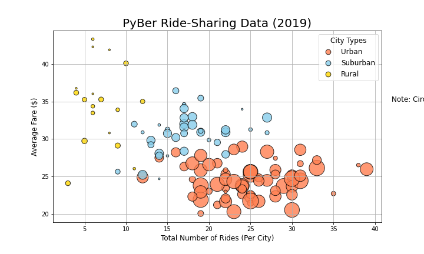

# PyBer_Analysis

## Resources
* Python 3.10
* Jupyter Notebook 6.4.5

### Overview of the analysis: 
The purpose of this analysis is to get an overview of PyBer's ride sharing business. Over the course of the analysis we will examine key business metrics including average fares, driver count, and ridership data for three distinct types of city where the business operates. This analysis will be instrumental in understanding strength and challenges in the business as it stands and providing recommendations for improving the business in the future.

### Results:
#### Overview

This plot is a "veiw from the top" summarizing all the data we looked at in what is called a bubble chart. We will drill down furthur into the data with the figures below.

#### Ride Count Distribution by City Type

The figure above shows the disparity in number of rides that occur int different types of markets PyBer operates in. We can also see that the variability of the data is increased in larger markets

#### Driver Count Distribution by City Type

The driver count by city type tells the same story as the ride count data. As markets get larger both the raw number of drivers increases and the distribution of drivers per city is also more variable

#### Fares by City Type

This figure gives us an interesting view of the average fare for a ride in each city type. Interestingly fares are much higher the smaller the market gets. There are a few common-sense reasons for this. First, as the previous charts show smaller markets have far fewer drivers than the large markets. The constrained supply of drivers in small markets likely inflates the price per ride. It also stands to reason that they average distance of a ride goes up and the markets get less densely populated. 

#### Total Fares by City Type

The graph clearly indicates that urban markets make up the bulk of PyBer's revenue stream, accounting for ten times as much revenue as rural markets and twice as much as Suburban markets.

#### Ridership by City Type

This data comparing the number of rides by city count tells the same story as the breakdown of fares by type. Urban markets account for the bulk of all rides provided by the service. One interesting thing to note is that Urban markets account for a larger percentage of rides on the service than revenue generated.

#### Employees by City Type

This figure starts to round out the picture. It shows that over 80% of all of the company's employees work in urban markets. With less than three percent operating in small rural markets.

#### Total Fares by Month

### Summary:
 Based on the results of this analysis the foremost recommendation to PyBer's CEO to improve the business is to recruit more drivers in rural markets. The data suggests that rural markets are underserved and has the best potential for growth. Rural rides generate more revenue on a per ride basis in any other market. This suggests that demand is not being fulfilled in these smaller markets. Rural trips tend to be longer, thus cost more but the tiny number of drivers available in these markets (less than 3% of the overall driver population) likely makes using the service in rural markets less reliable and convenient. In the transportation industry reliability and convenience are king.
